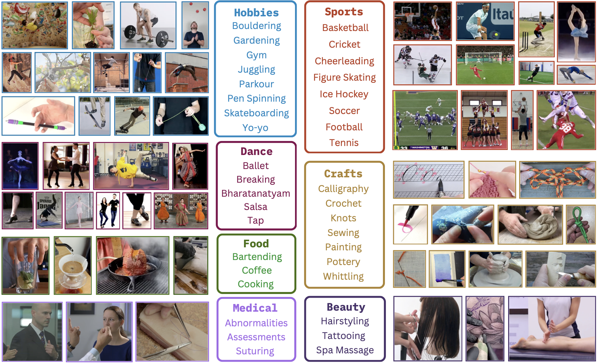

# VideoNet: Domain-Specific Action Recognition with VLMs

<p align="center">
    CVPR 2026 <strong>Highlight</strong>
</p>

<p align="center">
    <a target="_blank" href="https://arxiv.org/pdf/2605.02834"><strong>📄 Paper</strong></a> | <a target="_blank" href="https://huggingface.co/datasets/raivn/VideoNet"><strong>🤗 Data</strong></a> | <a target="_blank" href="https://tanu.sh/videonet"><strong>🌐 Website</strong></a> | <a target="_blank" href="https://tanu.sh/videonet/data"><strong>▶️ Demo</strong></a>
</p>



## Overview

VideoNet contains **1,000** actions across **37** domains.

It supports two evaluation setups:

| Setup | Test Set Size | Val Set Size | Targeted Model Capability |
| ----- | ----- | ----- | ----- | 
| Multiple Choice | 4,000 | 1,000 | domain-specific action recognition |
| Binary | 4,000 | N/A | video in-context learning |

We believe most researchers will want to evaluate on the multiple choice evaluation setting.

<details>

<summary>An explanation of the binary setup.</summary>

The binary setup is as follows:

- A model is shown $k \in \{0, 1, 2, 3\}$ example videos of some action $a_1$
- The model is then shown a test clip (which may or may not contain $a_1$)
- The model must determine if the test clip contains $a_1$
</details>

### Examples

<details>
<summary>Multiple-Choice Example</summary>

**Question:**

> Which of the following Pen Spinning actions is shown in the video?
> 
> A. warped sonic
> 
> B. twisted sonic reverse
> 
> C. charge reverse
> 
> D. devil's sonic
> 
> Please respond with only the letter of the correct answer.
>
> https://github.com/user-attachments/assets/c8684253-0326-47ad-a710-f8ef28b56634

**Answer:**

> B

</details>

<details>

<summary>Binary 0-shot Example</summary>

**Question:**
> Recall that a Double Flip is an action in Figure Skating. Does the following video show a Double Flip? Please reason through your answer. It is critical that you output 'yes' or 'no' on the final line of your answer.
> 
> https://github.com/user-attachments/assets/1335c7ed-f658-46ae-8ba5-14db0e0e599c

**Answer:**
> Yes

</details>

<details>

<summary>Binary 3-shot Example</summary>

**Question:**

> The following three videos show a Double Flip, which is an action in Figure Skating. Examine the videos closely.
> 
> https://github.com/user-attachments/assets/8d246ecc-93d9-4410-9ce3-8c4c00940052
> 
> https://github.com/user-attachments/assets/60fa440c-5b84-4040-8b40-ffb4f6019eb1
> 
> https://github.com/user-attachments/assets/c303463a-e4ff-464f-b79f-f31c8d0b9aef
> 
> Now consider the following video. Does it also show a Double Flip? Please reason through your answer. It is critical that you output 'yes' or 'no' on the final line of your answer.
> 
> https://github.com/user-attachments/assets/1335c7ed-f658-46ae-8ba5-14db0e0e599c

**Answer:**

> Yes

</details>

## Evaluation

There are three ways to evaluate models on VideoNet

1. Use our repo
2. Use `lmms-eval`
3. Integrate our JSONL files into your codebase

### Option 1 (Recommended)

We provide code to run GPT, Gemini, Qwen, and Intern models on VideoNet.

#### 1.1 Clone this repo.

```bash
git clone https://github.com/RAIVNLab/VideoNet.git
cd VideoNet
```

#### 1.2 Download the videos.

> [!TIP] 
> Already have a copy of VideoNet? You can skip the steps below by simply setting the env variable `VN_VIDEOS_DIR` to the folder that contains your copy of VideoNet's MP4 files.

<details>
<summary>Prereq: Install the HuggingFace library</summary>

```bash
pip install -U huggingface_hub
hf auth login
```

Since our dataset is gated on 🤗, you may need to [generate a token](https://huggingface.co/settings/tokens) and store it in the `HF_TOKEN` env variable. 

</details>

<details>
<summary> Option A: Download via 🤗 CLI</summary>

```bash
hf download raivn/VideoNet --include "videos/*" --repo-type dataset --local-dir .
```

Ensure that all videos are placed in a `videos` folder at the root of this repository.
</details>

<details>
<summary> Option B: Download via 🤗 Python library </summary>

```python
from huggingface_hub import snapshot_download

snapshot_download(
    repo_id="raivn/VideoNet",
    allow_patterns="videos/*",
    local_dir=".",
    repo_type="dataset",
)
```

Ensure that all videos are placed in a `videos` folder at the root of this repository.
</details>

#### 1.3 Pick a model.

<details>
<summary>GPT</summary>

##### Options:

- `gpt-5.4`
- `gpt-5`

##### Requirements:
```bash
pip install openai
pip install opencv-python
export OPENAI_API_KEY="your_openai_key"
```

</details>

<details>
<summary>Gemini</summary>

##### Options:

- `gemini-3.1-pro`
- `gemini-3-flash`

##### Requirements:
```bash
pip install -U google-genai
export GEMINI_API_KEY="your_gemini_key"
```

</details>


<details>
<summary>Qwen VL</summary>

##### Options:

- `Qwen3-VL-8B-Instruct`

##### Requirements:

```bash
pip install torch torchvision
pip install accelerate
pip install -U transformers
pip install qwen-vl-utils[decord]
```

Optionally, you can decide where Qwen's weights will be downloaded by setting the env variable `VN_MODELS_DIR`. If not specified, we will create a `models` directory at the root of this repository to store all models.

</details>

<details>
<summary>Intern VL</summary>

##### Options:

- `InternVL3_5-8B`
- `InternVL3-8B`

##### Requirements:

```bash
pip install torch torchvision
pip install transformers==4.55.0
pip install timm
pip install einops
```

Optionally, you can decide where Intern's weights will be downloaded by setting the env variable `VN_MODELS_DIR`. If not specified, we will create a `models` directory at the root of this repository to store all models.

</details>

#### 1.4 Run the evaluation.

Once you have completed the steps above, you are ready to evaluate on VideoNet!

Here are some quick-start examples:

```bash
python src/eval.py -m gemini-3.1-pro --mcq-test
```

```bash
python src/eval.py -m gpt-5.4 --mcq-val --max-frames 256 --reasoning-level xhigh
```

```bash
python src/eval.py -m Qwen3-VL-8B-Instruct -k 0 --fps 1 --enable-flash-attn
```

To start a model evaluation, run `src/eval.py` from the **root** of the repository. You can specify your desired model with the `-m` flag. For MCQ evaluations, provide the `--mcq-test` flag or the `--mcq-val` flag. For binary evaluations, provide `-k {0, 1, 2, 3}` to specify the number of in-context examples shown to the model.

For certain models, you can further specify the video sampling rate (via `--fps`) or the max number of frames sampled (via `--max-frames`). For GPT and Gemini models, you can specify the reasoning level via `--reasoning-level`. For local models, you can also enable the use of Flash Attention with `--enable-flash-attn`.

Your outputs will be saved in a JSON file in the auto-generated `results` directory. A summary of the results will be printed once your evaluation run concludes.

<details>
<summary>Results Structure</summary>
The results JSON file will hold a dictionary. 

Conceptually, each key in this dictionary corresponds to a question in your chosen configuration of the VideoNet benchmark.

Literally, keys correspond to their respective question's `key` field in the JSONL file for your chosen benchmark configuration.

A key maps to a dictionary containing the following:

- `accurate`: `1`, `0`, or `-1` (as ints) depending on if model response was correct, inaccurate, or unparsable, respectively.
- `prediction`: prediction we extracted from model response (see parser functions in `src/utils.py`)
- `response`: raw model response

If loaded into Python, the entire results dictionary would have the type signature `dict[str, dict[str, int | str]]`.
</details>

### Option 2: `lmms-eval`

VideoNet is [integrated](https://github.com/EvolvingLMMs-Lab/lmms-eval/pull/1308) into the [lmms-eval](https://github.com/EvolvingLMMs-Lab/lmms-eval) codebase. Here are the specific task names:

- `videonet_mcq_test`
- `videonet_mcq_val`
- `videonet_binary_0shot`
- `videonet_binary_1shot`
- `videonet_binary_2shot`
- `videonet_binary_3shot`

### Option 3: Integrating with Your Codebase

We provide six JSONL files in the `benchmarks` [directory](https://github.com/RAIVNLab/VideoNet/tree/main/benchmarks) of this repo, one per evaluation configuration. 

Each line in the JSONL file is a benchmark question represented as a JSON dictionary.

Here is an example from the MCQ validation set.
```json
{
    "key": "1-mcq-val-1", 
    "question": [
        {
            "type": "text", 
            "text": "Which of the following Figure Skating actions is shown in the video?\nA. split jump\nB. camel spin\nC. cantilever\nD. biellmann spin\nPlease respond with only the letter of the correct answer."
        }, 
        {
            "type": "video", 
            "video": "d0f9e765-a102-4e63-90bf-5605440e4adf.mp4"
        }
    ],
    "answer": "D"
}
```

<details> 

<summary>
Technical Specification of VideoNet JSONL files
</summary>

Each line is a JSON dictionary with the following keys:

- `key`: a string; the unique identifier for the question.
  - e.g., `29-pos-1` indicates this is the 1st positive (i.e., the ground truth is "yes") binary test clip for action #29.
  - e.g., `29-neg-2` indicates this is the 2nd negative (i.e., the ground truth is "no") binary test clip for action #29.
  - e.g., `32-mcq-val-1` indicates this is the 1st multiple-choice question (from the MCQ val set) for action #32.
  - e.g., `32-mcq-test-4` indicates this is the 4th multiple-choice question (from the MCQ test set) for action #32.
- `question`: a list of dictionaries
  - all dictionaries have a `type` key which takes the value `text` or `video`.
  - dictionaries also have either a `text` key or `video` key. In the latter case, the corresponding value is a string containing the video's filename.
- `answer`: a string; the ground-truth for this question.

</details>


<!-- We also provide verbose versions of these JSONL files, that include separate fields with the action name, domain name, action definition, etc. The verbose versions are NOT necessary to evaluate your model on VideoNet; they are provided with the hope that they may be convenient for debugging or interpreting model outputs. -->

<!-- If your VLM requires video metadata, you can find the relevant metadata [here](TODO). -->

## Training Data

Please refer to the [HuggingFace](https://huggingface.co/datasets/raivn/VideoNet).

## Acknowledgements

This project is partially funded by a grant from Apple.

The structure of this repository is inspired by [TOMATO](https://github.com/yale-nlp/TOMATO/). 

## Citation

```
@misc{yadav2026videonet,
      title={VideoNet: A Large-Scale Dataset for Domain-Specific Action Recognition}, 
      author={Tanush Yadav and Mohammadreza Salehi and Jae Sung Park and Vivek Ramanujan and Hannaneh Hajishirzi and Yejin Choi and Ali Farhadi and Rohun Tripathi and Ranjay Krishna},
      year={2026},
      eprint={2605.02834},
      archivePrefix={arXiv},
      primaryClass={cs.CV},
      url={https://arxiv.org/abs/2605.02834}, 
}
```
